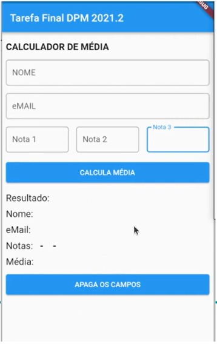
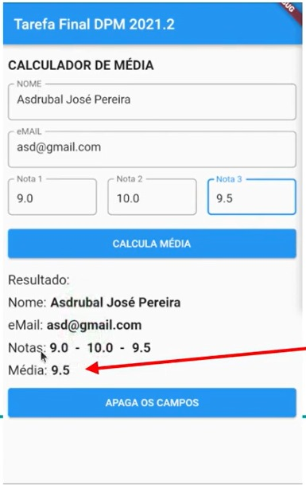

# average_calculator

Exercício Avaliativo 3 - Calculadora de média - Trabalho da disciplina Desenvolvimento
Multiplataforma 1 da Especialização em Desenvolvimento de Sistemas para Dispositivos Móveis - IFSP.

## Esperado

 

## Resultado

  
